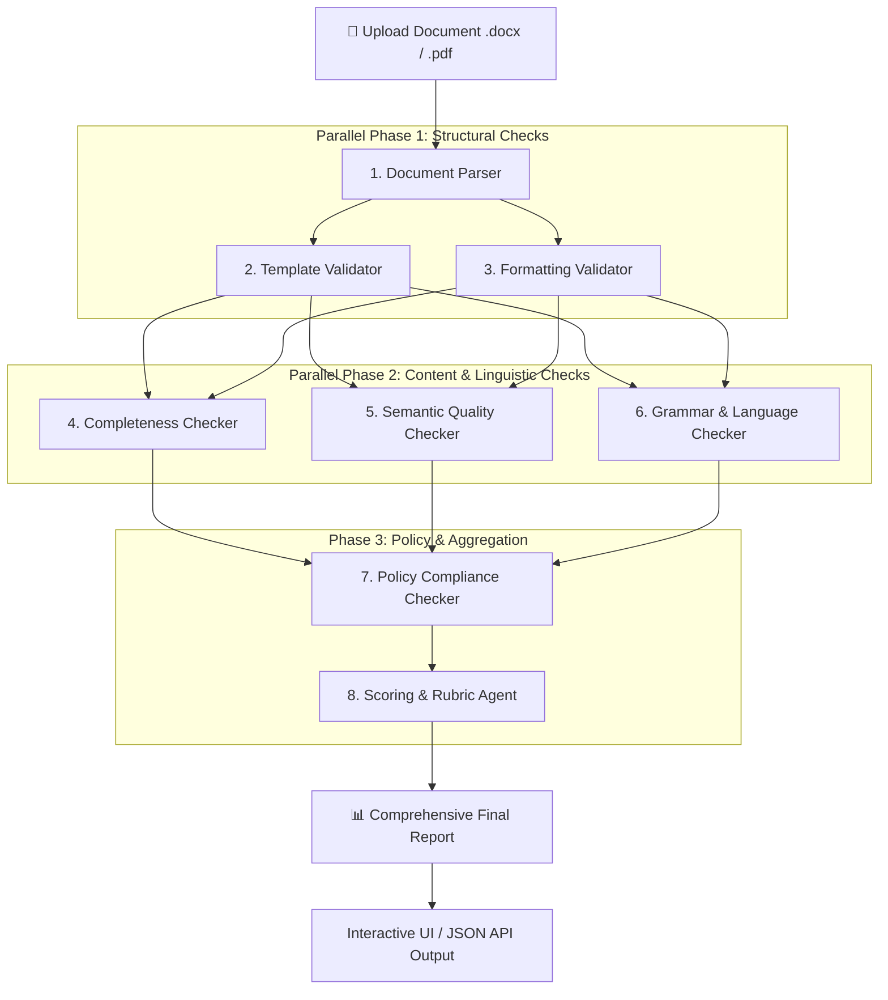

# 📄 Guest Lecture Document Review Agent

[](https://github.com/MSHREE26092007/guest-lecture-review/actions/workflows/ci.yml)
[](https://guest-lecture-review.vercel.app)
[](https://www.python.org/)
[](https://fastapi.tiangolo.com/)
[](https://github.com/langchain-ai/langgraph)
[](https://streamlit.io/)
[](LICENSE)

An intelligent, multi-module document review agent that ingests university guest lecture reports (`.docx` or `.pdf`), analyzes them against strict institutional guidelines across **7 automated evaluation dimensions**, and generates comprehensive scorecards with actionable improvement suggestions.

---

## 🌐 Live Demonstrations

| Interface | URL | Description |
| :--- | :--- | :--- |
| **🚀 Production Web App** | [https://guest-lecture-review.vercel.app](https://guest-lecture-review.vercel.app) | Full interactive web application deployed on Vercel Serverless with drag-and-drop document upload and live scorecard inspection. |
| **📊 Streamlit Dashboard** | `http://localhost:8501` | Interactive local dashboard with module toggles and detailed criteria inspections. |
| **⚡ OpenAPI / Swagger Docs** | [https://guest-lecture-review.vercel.app/docs](https://guest-lecture-review.vercel.app/docs) | Interactive API explorer and schema documentation. |

---

## 🌟 Key Features

- **Multi-Format Ingestion**: High-fidelity parsing of Microsoft Word (`.docx`) and Adobe PDF (`.pdf`) documents, including structural section identification, tables, images, metadata, headers, and footers.
- **7-Dimension Review Pipeline**:
  1. **Template Compliance** — Validates required institutional fields (speaker name, venue, coordinator, etc.).
  2. **Formatting Analysis** — Inspects font families, heading hierarchy, margins, line spacing, and page numbering.
  3. **Content Completeness** — Verifies presence and substance of objectives, lecture summary, and student participation.
  4. **Semantic Coherence** — Quantifies thematic alignment across title, objectives, and outcomes.
  5. **Grammar & Language Quality** — Detects spelling errors, syntactic flaws, and checks academic tone.
  6. **Institutional Policy Check** — Enforces minimum page count, image quotas, and signature verification.
  7. **Weighted Rubric Scoring** — Generates a deterministic, transparent 0–100 composite score with letter grades (A–F).
- **Resilient Serverless Architecture**: Optimized for zero-cold-start edge execution on Vercel Serverless with pure-Python fallbacks.
- **Stateful Graph Orchestration**: Built with **LangGraph** StateGraph for fault tolerance and execution tracing.
- **Customizable Rules**: All checklist criteria, formatting rules, policies, and scoring weights are externally configurable via YAML files without code changes.

---

## 🏗️ Architecture & Pipeline Workflow

The review process executes as a coordinated Directed Acyclic Graph (DAG):



---

## 📋 Evaluation Modules & Rubric Breakdown

| Module | Description | Analysis Technique | Weight |
| :--- | :--- | :--- | :---: |
| **1. Template Compliance** | Checks institutional fields (speaker details, date, coordinator, etc.) | YAML rule-matching against extracted text | **20 pts** |
| **2. Formatting Spec** | Evaluates fonts, heading sizes, margins, line spacing, and page numbers | Document AST Inspection | **15 pts** |
| **3. Content Completeness** | Validates objectives, lecture summary, and student participation sections | Keyword heuristics / LLM extraction | **20 pts** |
| **4. Semantic Quality** | Assesses thematic alignment between title, summary, and learning outcomes | Cosine similarity & semantic checks | **10 pts** |
| **5. Grammar & Language** | Checks spelling, grammatical issues, and academic tone | LanguageTool API & linguistic rules | **10 pts** |
| **6. Images & Media** | Verifies photographic evidence and event documentation | Image run extraction & quota verification | **5 pts** |
| **7. Signatures & Approvals**| Detects presence of faculty coordinator / HOD signature blocks | Structural keyword detection | **5 pts** |
| **8. Overall Quality** | Holistic synthesis and contextual evaluation | Subjective aggregate scoring | **15 pts** |
| **Total** | | | **100 pts** |

### Grading Scale
- **Grade A**: `85.0 – 100.0` (Excellent compliance)
- **Grade B**: `70.0 – 84.9` (Good, minor revisions needed)
- **Grade C**: `50.0 – 69.9` (Satisfactory, notable items missing)
- **Grade D**: `40.0 – 49.9` (Poor, major structural issues)
- **Grade F**: `< 40.0` (Incomplete / Non-compliant)

---

## 🗂️ Project Structure

```
guest-lecture-review/
├── .github/
│   └── workflows/
│       └── ci.yml               # GitHub Actions CI workflow (Python 3.10-3.12)
├── api/
│   ├── index.py                 # Vercel Serverless Function entry point
│   └── requirements.txt         # Serverless-optimized dependencies
├── app/
│   ├── api/
│   │   ├── main.py              # FastAPI application & REST routing
│   │   └── ui_page.py           # Embedded responsive Web Dashboard (HTML/CSS/JS)
│   ├── checkers/
│   │   ├── completeness/        # Content completeness evaluation
│   │   ├── grammar/             # Grammar & linguistic checker (LanguageTool)
│   │   ├── policy/              # Institutional policy checklist
│   │   └── semantic/            # Embeddings & thematic alignment
│   ├── config.py                # Pydantic BaseSettings environment manager
│   ├── config_loader.py         # YAML configuration loader
│   ├── db/                      # Database models & SQLAlchemy sessions
│   ├── llm/                     # LLM client abstractions & structured prompts
│   ├── orchestration/
│   │   ├── graph.py             # LangGraph StateGraph orchestration
│   │   └── state.py             # Pydantic PipelineState definitions
│   ├── parser/
│   │   ├── docx_parser.py       # DOCX extraction via python-docx
│   │   ├── pdf_parser.py        # PDF parser with pure-Python pypdf fallback
│   │   └── ocr.py               # PaddleOCR scanned document fallback
│   ├── schemas/                 # Pydantic request/response data models
│   ├── scoring/
│   │   └── scoring_agent.py     # Rubric calculation & report generator
│   ├── ui/
│   │   └── app.py               # Streamlit interactive application
│   └── validators/
│       ├── formatting/          # Font, margin, spacing validator
│       └── template/            # Required template field validator
├── config/
│   ├── formatting_spec.yaml     # Configurable formatting specifications
│   ├── policy_checklist.yaml    # Configurable policy requirements
│   ├── required_fields.yaml     # Configurable required template fields
│   └── scoring_rubric.yaml      # Configurable criteria weights & modes
├── samples/
│   ├── report_good.docx         # Sample benchmark document (Passing Grade)
│   └── report_bad.docx          # Sample benchmark document (Failing Grade)
├── tests/
│   ├── conftest.py              # Pytest fixtures and test document generator
│   ├── test_api.py              # FastAPI endpoint integration tests
│   ├── test_formatting_validator.py # Formatting test suite
│   ├── test_policy_checker.py   # Policy checker test suite
│   ├── test_scoring.py          # Rubric scoring test suite
│   └── test_template_validator.py # Template field validator test suite
├── Dockerfile                   # Production container definition
├── requirements.txt             # Primary Python dependencies
├── vercel.json                  # Vercel serverless deployment routing
├── CONTRIBUTING.md              # Contribution guidelines
└── LICENSE                      # MIT Open Source License
```

---

## 🚀 Getting Started

### Prerequisites
- **Python 3.10+** (Python 3.12 recommended)
- `git`

### 1. Clone & Set Up Environment
```bash
git clone https://github.com/MSHREE26092007/guest-lecture-review.git
cd guest-lecture-review

# Create virtual environment
python -m venv .venv
source .venv/bin/activate       # On Windows: .venv\Scripts\activate

# Install dependencies
pip install -r requirements.txt
```

### 2. Configure Environment Variables (Optional)
```bash
cp .env.example .env
```
*(LLM and Embeddings gracefully fall back to deterministic parsing if API keys are not provided)*

### 3. Run the Applications

#### Option A: Run FastAPI Server (with embedded Web Dashboard)
```bash
uvicorn app.api.main:app --reload --port 8000
```
Open your browser at `http://localhost:8000`.

#### Option B: Run Streamlit Prototype
```bash
streamlit run app/ui/app.py --server.port 8501
```
Open your browser at `http://localhost:8501`.

---

## 📡 REST API Reference

| Method | Endpoint | Description |
| :--- | :--- | :--- |
| `GET` | `/` | Serves the responsive interactive Document Review Agent Web Dashboard. |
| `GET` | `/health` | Healthcheck endpoint (`{"healthy": true}`). |
| `POST`| `/upload` | Uploads a `.docx` or `.pdf` file. Returns `{ "submission_id": "...", "filename": "..." }`. |
| `POST`| `/review/{submission_id}` | Executes the full 7-module review graph and returns the complete final scorecard. |
| `GET` | `/status/{submission_id}` | Retrieves execution progress across all modules. |
| `GET` | `/report/{submission_id}` | Fetches the finalized score, grade, criteria, missing items, and suggestions. |

### Example cURL Request:
```bash
# 1. Upload document
curl -F "file=@samples/report_good.docx" https://guest-lecture-review.vercel.app/upload

# 2. Execute analysis
curl -X POST https://guest-lecture-review.vercel.app/review/<SUBMISSION_ID>
```

---

## 🧪 Automated Testing

The project includes an automated test suite with full pipeline coverage:

```bash
pytest -v
```

```text
tests/test_api.py::test_root_endpoint PASSED
tests/test_api.py::test_health_endpoint PASSED
tests/test_api.py::test_upload_and_review_flow PASSED
tests/test_formatting_validator.py::test_good_report_formatting PASSED
tests/test_formatting_validator.py::test_bad_report_formatting PASSED
tests/test_policy_checker.py::test_good_report_policy PASSED
tests/test_policy_checker.py::test_bad_report_policy PASSED
tests/test_scoring.py::test_good_report_scoring PASSED
tests/test_scoring.py::test_bad_report_scoring PASSED
tests/test_template_validator.py::test_good_report_template PASSED
tests/test_template_validator.py::test_bad_report_template PASSED

======================== 14 passed in 35.89s ========================
```

---

## 🐳 Docker Deployment

Build and run using Docker:

```bash
# Build image
docker build -t guest-lecture-review .

# Run container
docker run -p 8000:8000 guest-lecture-review
```

---

## 🤝 Contributing

Contributions are welcome! Please review [CONTRIBUTING.md](CONTRIBUTING.md) for details on submitting issues and pull requests.

---

## 📄 License

This project is licensed under the [MIT License](LICENSE) © 2026 MSHREE26092007.